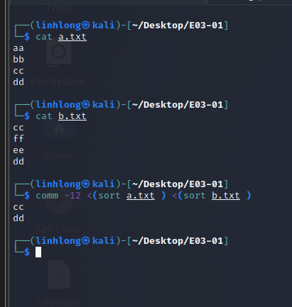

# \#E03-01 3-Command-line

### **Đề:**Cho 2 file

**a.txt**

aa

bb

cc

dd

**b.txt**

cc

ff

ee

dd

Sử dụng command line

1. Tìm các line chỉ có trong a.txt.

2. Tìm các line chỉ có trong b.txt

3. Tìm các line có trong cả 2 file.

### **Bài làm:**

1. **Dùng ‘comm’:**
   1. Tìm các line chỉ có trong a.txt:

* 1. Tìm các line chỉ có trong b.txt:

* 1. Tìm các line có trong cả 2 file:

1. **Dùng ‘diff’:**
   1. Tìm các line chỉ có trong a.txt:

* 1. Tìm các line chỉ có trong b.txt:

* 1. Tìm các line có trong cả 2 file:

1. **Dùng ‘grep’:**
   1. Tìm các line chỉ có trong a.txt:

* 1. Tìm các line chỉ có trong b.txt:

* 1. Tìm các line có trong cả 2 file:

